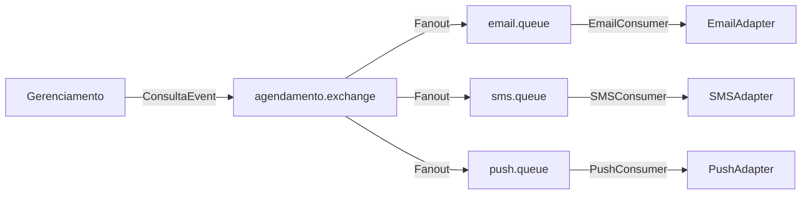
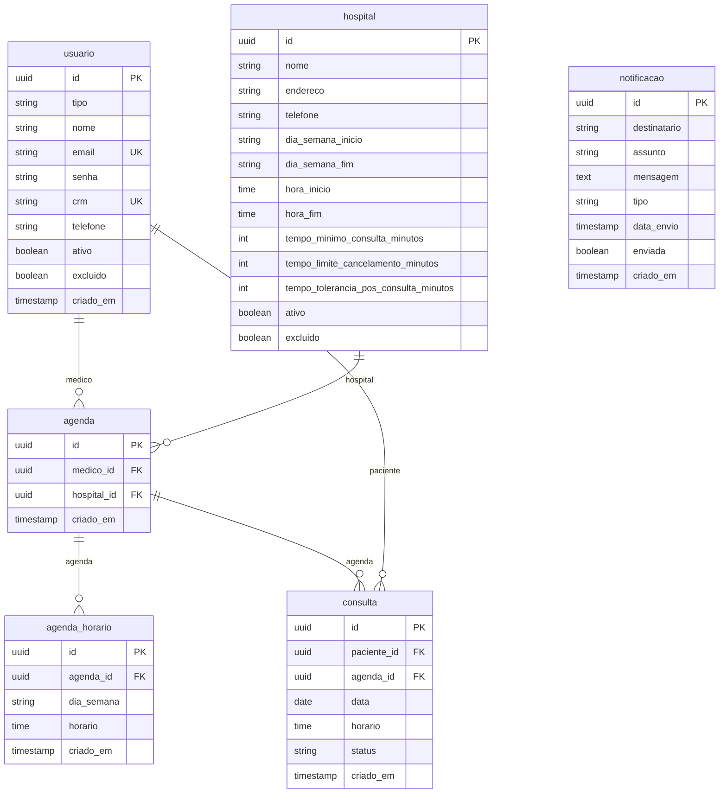
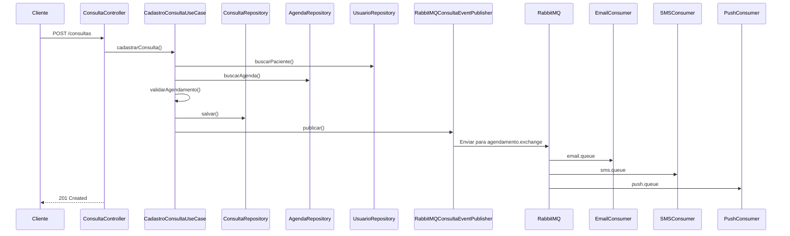
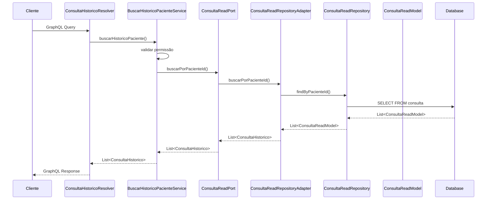
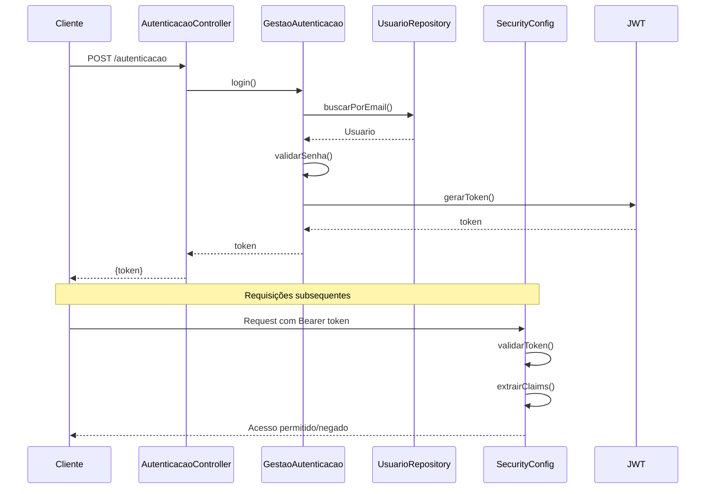

# Sistema de Agendamento Hospitalar

Sistema de agendamento de consultas médicas desenvolvido para o Tech Challenge da FIAP. A aplicação permite o gerenciamento completo de agendamentos hospitalares, incluindo cadastro de usuários, gestão de agendas, agendamento de consultas, histórico médico via GraphQL e notificações assíncronas.

## Visão Geral

O sistema resolve o problema de agendamento de consultas em ambientes hospitalares, permitindo:

- Cadastro e gestão de usuários (pacientes, médicos, enfermeiros, administradores)
- Configuração de hospitais e suas regras de funcionamento
- Criação de agendas médicas com horários disponíveis
- Agendamento de consultas com validação de disponibilidade
- Acompanhamento do histórico médico de pacientes via GraphQL
- Envio de notificações (email, SMS, push) de forma assíncrona
- Controle de acesso baseado em roles e autorização por contexto

## Estrutura do Projeto

O projeto é organizado como um aplicativo multi-módulo Maven seguindo os princípios de Clean Architecture e Hexagonal Architecture (Ports & Adapters).

```
agendamento-hospitalar-app/
├── agendamento-bootstrap/          # Módulo de inicialização
├── agendamento-gerenciamento/      # Módulo de gerenciamento (core)
├── agendamento-notificacao/        # Módulo de notificações
├── agendamento-historico/          # Módulo de histórico (GraphQL)
├── docker-compose.yml
├── Dockerfile
└── pom.xml
```

### Módulos

#### agendamento-bootstrap
Módulo responsável pela inicialização da aplicação. Configura o contexto Spring, integra todos os módulos e executa as migrations do Flyway.

- **Responsabilidade**: Inicialização e orquestração dos módulos
- **Componentes principais**:
  - `AgendamentoApplication.java`: Classe principal da aplicação Spring Boot
  - `application.yaml`: Configurações centralizadas (datasource, RabbitMQ, security)
  - Flyway migrations: Executa migrations de todos os módulos

#### agendamento-gerenciamento
Módulo central responsável pelo gerenciamento de todas as operações de negócio relacionadas a usuários, hospitais, agendas e consultas.

- **Responsabilidade**: CRUD completo e regras de negócio do sistema
- **Camadas**:
  - `domain/`: Entidades de domínio e regras de negócio
  - `application/`: Use cases, DTOs e ports
  - `infrastructure/`: Controllers, repositories, adapters, configurações

#### agendamento-notificacao
Módulo responsável pelo envio de notificações de forma assíncrona via RabbitMQ.

- **Responsabilidade**: Envio de notificações (email, SMS, push)
- **Padrão**: Strategy Pattern para diferentes tipos de notificação
- **Integração**: Consome eventos do RabbitMQ publicados pelo módulo gerenciamento

#### agendamento-historico
Módulo responsável pela consulta de histórico médico via GraphQL.

- **Responsabilidade**: Leitura de histórico de consultas via GraphQL
- **Característica**: Read-only, não possui tabela própria (lê da tabela `consulta`)
- **Independência**: Possui sua própria entidade JPA (`ConsultaReadModel`) para evitar acoplamento

## Arquitetura

### Clean Architecture e Ports & Adapters

O projeto segue os princípios de Clean Architecture e Hexagonal Architecture, separando claramente as responsabilidades em três camadas principais:

```
┌─────────────────────────────────────────────────────────┐
│                    Infrastructure                        │
│  (Controllers, Repositories, Adapters, Configurations)  │
└─────────────────────────────────────────────────────────┘
                           ↕
┌─────────────────────────────────────────────────────────┐
│                     Application                          │
│        (Use Cases, DTOs, Ports In/Out)                  │
└─────────────────────────────────────────────────────────┘
                           ↕
┌─────────────────────────────────────────────────────────┐
│                       Domain                             │
│         (Entities, Value Objects, Business Rules)        │
└─────────────────────────────────────────────────────────┘
```

### Estrutura de Pacotes (agendamento-gerenciamento)

```
agendamento-gerenciamento/
└── src/main/java/br/com/fiap/agendamento/gerenciamento/
    ├── application/
    │   ├── agenda/
    │   │   ├── dto/
    │   │   ├── ports/in/ (GestaoCadastroAgenda, GestaoConsultaAgenda)
    │   │   ├── ports/out/ (AgendaRepository)
    │   │   └── usecases/ (CadastroAgendaUseCase, ConsultaAgendaUseCase)
    │   ├── consulta/
    │   │   ├── dto/
    │   │   ├── enums/ (ConsultaEventType)
    │   │   ├── ports/in/ (GestaoCadastroConsulta, GestaoConsultaConsulta)
    │   │   ├── ports/out/ (ConsultaRepository, ConsultaEventPublisher)
    │   │   └── usecases/ (CadastroConsultaUseCase, ConsultaConsultaUseCase)
    │   ├── hospital/
    │   │   ├── dto/
    │   │   ├── ports/in/ (GestaoCadastroHospital, GestaoConsultaHospital)
    │   │   ├── ports/out/ (HospitalRepository)
    │   │   └── usecases/ (CadastroHospitalUseCase, ConsultaHospitalUseCase)
    │   ├── usuario/
    │   │   ├── dto/
    │   │   ├── ports/in/ (GestaoCadastroUsuario, GestaoConsultaUsuario, GestaoEditarUsuario, GestaoAutenticacao)
    │   │   ├── ports/out/ (UsuarioRepository)
    │   │   └── usecases/
    │   └── dto/ (UsuarioAutenticado)
    ├── domain/
    │   ├── agenda/
    │   │   ├── entity/ (Agenda, HorarioAgenda)
    │   │   └── exception/
    │   ├── consulta/
    │   │   ├── entity/ (Consulta)
    │   │   ├── enums/ (StatusConsulta)
    │   │   └── exception/
    │   ├── hospital/
    │   │   ├── entity/ (Hospital)
    │   │   └── exception/
    │   ├── usuario/
    │   │   ├── entity/ (Usuario, Administrador, Medico, Paciente, Enfermeiro)
    │   │   ├── enums/ (TipoUsuario, Uf)
    │   │   ├── vo/ (Email, Telefone, Crm)
    │   │   └── exception/
    │   └── exception/
    └── infrastructure/
        ├── agenda/
        │   ├── persistence/ (model, repository, adapter, mapper)
        │   └── web/ (controller, dto, mapper)
        ├── autenticacao/
        │   └── web/ (controller, dto, mapper)
        ├── consulta/
        │   ├── persistence/ (model, repository, adapter, mapper)
        │   └── web/ (controller, dto, mapper)
        ├── hospital/
        │   ├── persistence/ (model, repository, adapter, mapper)
        │   └── web/ (controller, dto, mapper)
        ├── usuario/
        │   ├── persistence/ (model, repository, adapter, mapper)
        │   └── web/ (controller, dto, mapper)
        ├── config/
        │   ├── security/ (SecurityConfig, SecurityContextProvider)
        │   ├── exception/
        │   ├── mapper/
        │   ├── password/
        │   ├── response/
        │   ├── GerenciamentoRabbitMQConfig
        │   └── GerenciamentoUseCaseConfig
        └── messaging/rabbitmq/publisher/ (RabbitMQConsultaEventPublisher)
```

### Estrutura de Pacotes (agendamento-historico)

```
agendamento-historico/
└── src/main/java/br/com/fiap/agendamento/historico/
    ├── application/
    │   └── consulta/
    │       ├── ports/in/ (BuscarHistoricoPacienteUseCase, BuscarConsultasFuturasUseCase)
    │       ├── ports/out/ (ConsultaReadPort)
    │       └── service/ (BuscarHistoricoPacienteService, BuscarConsultasFuturasService)
    ├── domain/
    │   └── consulta/
    │       ├── entity/ (ConsultaHistorico)
    │       └── enums/ (StatusConsulta)
    └── infrastructure/
        ├── graphql/
        │   ├── schema.graphqls
        │   └── resolver/ (ConsultaHistoricoResolver)
        └── persistence/
            ├── model/ (ConsultaReadModel)
            ├── repository/ (ConsultaReadRepository)
            ├── adapter/ (ConsultaReadRepositoryAdapter)
            └── mapper/ (ConsultaHistoricoMapper)
```

### Estrutura de Pacotes (agendamento-notificacao)

```
agendamento-notificacao/
└── src/main/java/br/com/fiap/agendamento/notificacao/
    ├── application/
    │   ├── dto/ (NotificacaoConsultaDTO)
    │   └── notificacao/
    │       ├── dto/
    │       ├── ports/in/ (GestaoNotificacao)
    │       ├── ports/out/ (EnvioNotificacao, NotificacaoRepository)
    │       └── usecases/ (EnvioNotificacaoUseCase)
    ├── domain/
    │   ├── notificacao/
    │   │   ├── entity/ (Notificacao)
    │   │   ├── enums/ (TipoNotificacao)
    │   │   └── exception/
    │   └── exception/
    └── infrastructure/
        ├── config/
        │   ├── NotificacaoRabbitMQConfig
        │   ├── NotificacaoUseCaseConfig
        │   └── exception/
        └── notificacao/
            ├── adapter/ (EmailAdapter, SMSAdapter, PushAdapter)
            └── persistence/
                ├── model/ (NotificacaoModel)
                ├── repository/
                ├── adapter/
                ├── mapper/
                └── consumer/ (EmailConsumer, SMSConsumer, PushConsumer)
```

## APIs REST

### Base URL
Todas as APIs REST estão disponíveis em: `http://localhost:8080/api/v1`

### Autenticação

#### POST /api/v1/autenticacao
Autentica usuário e retorna token JWT.

- **Público**: Não requer autenticação
- **Request Body**:
```json
{
  "email": "admin@email.com",
  "senha": "senha123"
}
```
- **Response**:
```json
{
  "token": "eyJhbGciOiJIUzI1NiIsInR5cCI6IkpXVCJ9..."
}
```

### Usuários

#### POST /api/v1/usuarios/pacientes
Cadastra um novo paciente.

- **Público**: Não requer autenticação
- **Request Body**:
```json
{
  "nome": "João Silva",
  "email": "joao@email.com",
  "senha": "senha123",
  "telefone": "11999999999"
}
```
- **Response**: `UsuarioResponse` com dados do paciente criado
- **Status**: 201 Created

#### POST /api/v1/usuarios/medicos
Cadastra um novo médico.

- **Autenticação**: Requer autenticação
- **Request Body**:
```json
{
  "nome": "Dr. Carlos",
  "email": "carlos@email.com",
  "senha": "senha123",
  "crm": "12345-SP",
  "telefone": "11999999999"
}
```
- **Response**: `UsuarioResponse` com dados do médico criado
- **Status**: 201 Created

#### POST /api/v1/usuarios/enfermeiros
Cadastra um novo enfermeiro.

- **Autenticação**: Requer autenticação
- **Request Body**:
```json
{
  "nome": "Enfermeira Ana",
  "email": "ana@email.com",
  "senha": "senha123",
  "telefone": "11999999999"
}
```
- **Response**: `UsuarioResponse` com dados do enfermeiro criado
- **Status**: 201 Created

#### POST /api/v1/usuarios/administradores
Cadastra um novo administrador.

- **Autenticação**: Requer autenticação
- **Request Body**:
```json
{
  "nome": "Admin Sistema",
  "email": "admin2@email.com",
  "senha": "senha123"
}
```
- **Response**: `UsuarioResponse` com dados do administrador criado
- **Status**: 201 Created

#### GET /api/v1/usuarios
Lista todos os usuários.

- **Autenticação**: Requer autenticação
- **Response**: Lista de `UsuarioResponse`
- **Status**: 200 OK

#### GET /api/v1/usuarios/{uuid}
Consulta usuário por ID.

- **Autenticação**: Requer autenticação
- **Path Variable**: `uuid` - ID do usuário
- **Response**: `UsuarioResponse`
- **Status**: 200 OK

#### PUT /api/v1/usuarios/pacientes/{uuid}
Edita dados de um paciente.

- **Autenticação**: Requer autenticação
- **Path Variable**: `uuid` - ID do paciente
- **Request Body**:
```json
{
  "nome": "João Silva Jr",
  "email": "joaojr@email.com",
  "telefone": "11988888888"
}
```
- **Response**: `UsuarioResponse` atualizado
- **Status**: 200 OK

#### PUT /api/v1/usuarios/medicos/{uuid}
Edita dados de um médico.

- **Autenticação**: Requer autenticação
- **Path Variable**: `uuid` - ID do médico
- **Request Body**:
```json
{
  "nome": "Dr. Carlos Jr",
  "email": "carlosjr@email.com",
  "crm": "54321-SP",
  "telefone": "11988888888"
}
```
- **Response**: `UsuarioResponse` atualizado
- **Status**: 200 OK

#### PUT /api/v1/usuarios/enfermeiro/{uuid}
Edita dados de um enfermeiro.

- **Autenticação**: Requer autenticação
- **Path Variable**: `uuid` - ID do enfermeiro
- **Request Body**:
```json
{
  "nome": "Enfermeira Ana Maria",
  "email": "anamaria@email.com",
  "telefone": "11988888888"
}
```
- **Response**: `UsuarioResponse` atualizado
- **Status**: 200 OK

#### PUT /api/v1/usuarios/administrador/{uuid}
Edita dados de um administrador.

- **Autenticação**: Requer autenticação
- **Path Variable**: `uuid` - ID do administrador
- **Request Body**:
```json
{
  "nome": "Admin Sistema 2",
  "email": "admin2@email.com"
}
```
- **Response**: `UsuarioResponse` atualizado
- **Status**: 200 OK

#### PATCH /api/v1/usuarios/{uuid}/senha
Altera senha de um usuário.

- **Autenticação**: Requer autenticação
- **Path Variable**: `uuid` - ID do usuário
- **Request Body**:
```json
{
  "novaSenha": "novaSenha123"
}
```
- **Status**: 204 No Content

#### PATCH /api/v1/usuarios/{uuid}/ativar
Ativa um usuário.

- **Autenticação**: Requer autenticação
- **Path Variable**: `uuid` - ID do usuário
- **Status**: 204 No Content

#### PATCH /api/v1/usuarios/{uuid}/inativar
Inativa um usuário.

- **Autenticação**: Requer autenticação
- **Path Variable**: `uuid` - ID do usuário
- **Status**: 204 No Content

#### DELETE /api/v1/usuarios/{uuid}
Exclui um usuário (soft delete).

- **Autenticação**: Requer autenticação
- **Path Variable**: `uuid` - ID do usuário
- **Status**: 204 No Content

### Hospitais

#### POST /api/v1/hospitais
Cadastra um novo hospital.

- **Autenticação**: Requer autenticação
- **Request Body**:
```json
{
  "nome": "Hospital Central",
  "endereco": "Rua Principal, 123",
  "telefone": "1133333333",
  "diaSemanaInicio": "MONDAY",
  "diaSemanaFim": "FRIDAY",
  "horaInicio": "08:00:00",
  "horaFim": "18:00:00",
  "tempoMinimoConsultaMinutos": 30,
  "tempoLimiteCancelamentoMinutos": 60,
  "tempoToleranciaPosConsultaMinutos": 15
}
```
- **Response**: `HospitalResponse`
- **Status**: 201 Created

#### GET /api/v1/hospitais
Lista todos os hospitais.

- **Autenticação**: Requer autenticação
- **Response**: Lista de `HospitalResponse`
- **Status**: 200 OK

#### GET /api/v1/hospitais/{uuid}
Consulta hospital por ID.

- **Autenticação**: Requer autenticação
- **Path Variable**: `uuid` - ID do hospital
- **Response**: `HospitalResponse`
- **Status**: 200 OK

#### PUT /api/v1/hospitais/{uuid}
Altera dados de um hospital.

- **Autenticação**: Requer autenticação
- **Path Variable**: `uuid` - ID do hospital
- **Request Body**: Mesmo formato do cadastro
- **Response**: `HospitalResponse` atualizado
- **Status**: 200 OK

#### PATCH /api/v1/hospitais/{uuid}/ativar
Ativa um hospital.

- **Autenticação**: Requer autenticação
- **Path Variable**: `uuid` - ID do hospital
- **Status**: 204 No Content

#### PATCH /api/v1/hospitais/{uuid}/inativar
Inativa um hospital.

- **Autenticação**: Requer autenticação
- **Path Variable**: `uuid` - ID do hospital
- **Status**: 204 No Content

#### DELETE /api/v1/hospitais/{uuid}
Exclui um hospital.

- **Autenticação**: Requer autenticação
- **Path Variable**: `uuid` - ID do hospital
- **Status**: 204 No Content

### Agendas

#### POST /api/v1/agendas
Cadastra uma nova agenda.

- **Autenticação**: Requer autenticação
- **Request Body**:
```json
{
  "medicoId": "uuid-do-medico",
  "hospitalId": "uuid-do-hospital",
  "horarios": [
    {
      "diaSemana": "MONDAY",
      "horario": "09:00:00"
    },
    {
      "diaSemana": "MONDAY",
      "horario": "10:00:00"
    }
  ]
}
```
- **Response**: `AgendaResponse`
- **Status**: 201 Created

#### GET /api/v1/agendas
Lista todas as agendas.

- **Autenticação**: Requer autenticação
- **Response**: Lista de `AgendaResponse`
- **Status**: 200 OK

#### GET /api/v1/agendas/{uuid}
Consulta agenda por ID.

- **Autenticação**: Requer autenticação
- **Path Variable**: `uuid` - ID da agenda
- **Response**: `AgendaResponse`
- **Status**: 200 OK

#### GET /api/v1/agendas/medico/{medicoUuid}
Lista agendas por médico.

- **Autenticação**: Requer autenticação
- **Path Variable**: `medicoUuid` - ID do médico
- **Response**: Lista de `AgendaResponse`
- **Status**: 200 OK

#### GET /api/v1/agendas/hospital/{hospitalUuid}
Lista agendas por hospital.

- **Autenticação**: Requer autenticação
- **Path Variable**: `hospitalUuid` - ID do hospital
- **Response**: Lista de `AgendaResponse`
- **Status**: 200 OK

#### POST /api/v1/agendas/{uuid}/horarios
Adiciona horários a uma agenda.

- **Autenticação**: Requer autenticação
- **Path Variable**: `uuid` - ID da agenda
- **Request Body**:
```json
{
  "horarios": [
    {
      "diaSemana": "TUESDAY",
      "horario": "14:00:00"
    }
  ]
}
```
- **Status**: 204 No Content

#### DELETE /api/v1/agendas/{uuid}/horarios/{horarioUuid}
Remove um horário de uma agenda.

- **Autenticação**: Requer autenticação
- **Path Variables**:
  - `uuid` - ID da agenda
  - `horarioUuid` - ID do horário
- **Status**: 204 No Content

### Consultas

#### POST /api/v1/consultas
Agenda uma nova consulta.

- **Autenticação**: Requer autenticação
- **Request Body**:
```json
{
  "pacienteId": "uuid-do-paciente",
  "agendaId": "uuid-da-agenda",
  "horarioId": "uuid-do-horario",
  "data": "2026-09-20"
}
```
- **Response**: `ConsultaResponse`
- **Status**: 201 Created
- **Eventos**: Publica evento `CONSULTA_CRIADA` no RabbitMQ

#### POST /api/v1/consultas/{uuid}/cancelar
Cancela uma consulta.

- **Autenticação**: Requer autenticação
- **Path Variable**: `uuid` - ID da consulta
- **Status**: 204 No Content
- **Eventos**: Publica evento `CONSULTA_ATUALIZADA` no RabbitMQ

#### POST /api/v1/consultas/{uuid}/confirmar
Confirma uma consulta.

- **Autenticação**: Requer autenticação
- **Path Variable**: `uuid` - ID da consulta
- **Status**: 204 No Content
- **Eventos**: Publica evento `CONSULTA_ATUALIZADA` no RabbitMQ

#### POST /api/v1/consultas/{uuid}/realizar
Marca consulta como realizada.

- **Autenticação**: Requer autenticação (ADMINISTRADOR ou MEDICO)
- **Path Variable**: `uuid` - ID da consulta
- **Status**: 204 No Content
- **Eventos**: Publica evento `CONSULTA_ATUALIZADA` no RabbitMQ

#### POST /api/v1/consultas/{uuid}/ausentar
Marca consulta como ausente.

- **Autenticação**: Requer autenticação (ADMINISTRADOR, ENFERMEIRO ou MEDICO)
- **Path Variable**: `uuid` - ID da consulta
- **Status**: 204 No Content
- **Eventos**: Publica evento `CONSULTA_ATUALIZADA` no RabbitMQ

#### GET /api/v1/consultas
Lista todas as consultas.

- **Autenticação**: Requer autenticação
- **Response**: Lista de `ConsultaResponse`
- **Status**: 200 OK

#### GET /api/v1/consultas/{uuid}
Consulta por ID.

- **Autenticação**: Requer autenticação
- **Path Variable**: `uuid` - ID da consulta
- **Response**: `ConsultaResponse`
- **Status**: 200 OK

#### GET /api/v1/consultas/pacientes/{uuid}
Lista consultas por paciente.

- **Autenticação**: Requer autenticação
- **Path Variable**: `uuid` - ID do paciente
- **Response**: Lista de `ConsultaResponse`
- **Status**: 200 OK

#### GET /api/v1/consultas/medicos/{uuid}
Lista consultas por médico.

- **Autenticação**: Requer autenticação
- **Path Variable**: `uuid` - ID do médico
- **Response**: Lista de `ConsultaResponse`
- **Status**: 200 OK

## GraphQL

### Endpoint
- **URL**: `http://localhost:8080/graphql`
- **Método**: POST
- **Content-Type**: application/json
- **Autenticação**: Requer JWT token no header `Authorization: Bearer <token>`

### Schema

```graphql
type Query {
    historicoPaciente(pacienteId: ID!): [ConsultaHistorico]
    consultasFuturas(pacienteId: ID!): [ConsultaHistorico]
}

type ConsultaHistorico {
    id: ID!
    pacienteId: ID!
    agendaId: ID!
    data: String!
    horario: String!
    status: String!
    criadoEm: String!
}
```

### Queries

#### historicoPaciente
Retorna todas as consultas de um paciente.

- **Autorização**: ROLE_ENFERMEIRO, ROLE_PACIENTE, ROLE_MEDICO
- **Regra de segurança**: Pacientes só podem visualizar seu próprio histórico
- **Argumentos**:
  - `pacienteId`: ID do paciente (ID!)

**Exemplo**:
```graphql
query {
    historicoPaciente(pacienteId: "123e4567-e89b-12d3-a456-426614174000") {
        id
        pacienteId
        agendaId
        data
        horario
        status
        criadoEm
    }
}
```

#### consultasFuturas
Retorna apenas as consultas futuras de um paciente (data/horário > data/horário atual).

- **Autorização**: ROLE_ENFERMEIRO, ROLE_PACIENTE, ROLE_MEDICO
- **Regra de segurança**: Pacientes só podem visualizar suas próprias consultas futuras
- **Argumentos**:
  - `pacienteId`: ID do paciente (ID!)

**Exemplo**:
```graphql
query {
    consultasFuturas(pacienteId: "123e4567-e89b-12d3-a456-426614174000") {
        id
        data
        horario
        status
    }
}
```

### Seleção Flexível de Campos

GraphQL permite selecionar apenas os campos necessários:

```graphql
query {
    historicoPaciente(pacienteId: "123e4567-e89b-12d3-a456-426614174000") {
        id
        data
        status
    }
}
```

## RabbitMQ

### Configuração

O sistema utiliza RabbitMQ para comunicação assíncrona entre módulos.

#### Exchange
- **Nome**: `agendamento.exchange`
- **Tipo**: FanoutExchange
- **Localização**: Configurada em `GerenciamentoRabbitMQConfig`

#### Queues
- **email.queue**: Recebe eventos para envio de email
- **sms.queue**: Recebe eventos para envio de SMS
- **push.queue**: Recebe eventos para envio de push notification

#### Bindings
Todas as queues estão vinculadas à `agendamento.exchange` (FanoutExchange), recebendo todos os eventos publicados.

### Fluxo de Eventos



### Eventos Publicados

#### ConsultaEvent
```java
{
    "eventType": "CONSULTA_CRIADA" | "CONSULTA_ATUALIZADA",
    "consultaId": UUID,
    "pacienteId": UUID,
    "dataHora": LocalDateTime
}
```

### Publishers

#### RabbitMQConsultaEventPublisher
- **Localização**: `agendamento-gerenciamento/infrastructure/messaging/rabbitmq/publisher`
- **Responsabilidade**: Publica eventos de criação e atualização de consultas
- **Métodos**:
  - `publicar(ConsultaEvent)`: Publica evento de criação
  - `publicarAtualizacao(ConsultaEvent)`: Publica evento de atualização

### Consumers

#### EmailConsumer
- **Localização**: `agendamento-notificacao/infrastructure/notificacao/persistence/consumer`
- **Queue**: `email.queue`
- **Responsabilidade**: Consome eventos e envia notificações por email

#### SMSConsumer
- **Localização**: `agendamento-notificacao/infrastructure/notificacao/persistence/consumer`
- **Queue**: `sms.queue`
- **Responsabilidade**: Consome eventos e envia notificações por SMS

#### PushConsumer
- **Localização**: `agendamento-notificacao/infrastructure/notificacao/persistence/consumer`
- **Queue**: `push.queue`
- **Responsabilidade**: Consome eventos e envia notificações push

### Adapters (Strategy Pattern)

#### EmailAdapter
- **Responsabilidade**: Implementação de envio de email
- **Interface**: `EnvioNotificacao`

#### SMSAdapter
- **Responsabilidade**: Implementação de envio de SMS
- **Interface**: `EnvioNotificacao`

#### PushAdapter
- **Responsabilidade**: Implementação de envio de push notification
- **Interface**: `EnvioNotificacao`

## Segurança e Autorização

### Spring Security Configuration

A aplicação utiliza Spring Security com autenticação via JWT.

#### Configuração
- **Classe**: `SecurityConfig`
- **Localização**: `agendamento-gerenciamento/infrastructure/config/security`

#### Endpoints Públicos
- `POST /api/v1/autenticacao/**`: Autenticação
- `POST /api/v1/usuarios/pacientes`: Cadastro de pacientes

#### Endpoints Protegidos
Todos os demais endpoints requerem autenticação via JWT.

### JWT

#### Configuração
- **Issuer**: "agendamento-api"
- **Secret Key**: Configurado em `application.yaml`
- **Expiration**: 3600 segundos (1 hora)
- **Authority Prefix**: "ROLE_"
- **Authorities Claim Name**: "role"

#### Claims
- `sub`: UUID do usuário
- `nome`: Nome do usuário
- `role`: Role do usuário (ROLE_ADMINISTRADOR, ROLE_ENFERMEIRO, ROLE_MEDICO, ROLE_PACIENTE)

### Roles e Permissões

#### Roles Disponíveis
- `ROLE_ADMINISTRADOR`: Administrador do sistema
- `ROLE_ENFERMEIRO`: Enfermeiro
- `ROLE_MEDICO`: Médico
- `ROLE_PACIENTE`: Paciente

#### Regras de Autorização

##### Autenticação
- **SecurityContextProvider**: Extrai informações do usuário autenticado do contexto Spring Security
- **UsuarioAutenticado**: DTO contendo UUID, nome e tipo do usuário autenticado

##### Validação por Contexto
A aplicação implementa autorização por contexto nos use cases:

- **Pacientes**: Só podem agendar/consultar/cancelar suas próprias consultas
- **Médicos**: Só podem realizar operações relacionadas às suas próprias consultas
- **Enfermeiros**: Podem visualizar e gerenciar consultas
- **Administradores**: Possuem acesso total

##### Exemplo de Validação (CadastroConsultaUseCase)
```java
if (usuarioAutenticado.tipo() == TipoUsuario.PACIENTE 
    && !usuarioAutenticado.uuid().equals(paciente.getId())) {
    throw new UsuarioNaoAutorizadoException();
}
```

### Regra de Acesso ao Histórico (GraphQL)

No módulo histórico, a regra de acesso é implementada nos services:

#### BuscarHistoricoPacienteService
```java
if ("PACIENTE".equals(role) && !authenticatedUserId.equals(pacienteId)) {
    throw new SecurityException("Paciente só pode visualizar seu próprio histórico");
}
```

#### BuscarConsultasFuturasService
```java
if ("PACIENTE".equals(role) && !authenticatedUserId.equals(pacienteId)) {
    throw new SecurityException("Paciente só pode visualizar suas próprias consultas futuras");
}
```

**✅ Implementado**: A regra de que pacientes só podem acessar seu próprio histórico está implementada e validada tanto no nível do GraphQL resolver quanto no nível dos use cases.

## Banco de Dados

### PostgreSQL

O sistema utiliza PostgreSQL como banco de dados relacional.

### Migrations (Flyway)

As migrations são organizadas por módulo:

#### agendamento-gerenciamento
- **V202609140930__gerenciamento_criacao_schema_inicial.sql**: Criação das tabelas iniciais
- **V202609141000__criacao_usuario_admin.sql**: Criação do usuário administrador padrão

#### agendamento-notificacao
- **V202609151000__notificacao_criacao_schema_inicial.sql**: Criação da tabela de notificações

### Modelo de Dados

#### Tabelas

##### usuario
Armazena todos os usuários do sistema (pacientes, médicos, enfermeiros, administradores).

- **Colunas**:
  - `id` (UUID, PK)
  - `tipo` (VARCHAR, CHECK: ADMINISTRADOR, ENFERMEIRO, MEDICO, PACIENTE)
  - `nome` (VARCHAR)
  - `email` (VARCHAR, UNIQUE)
  - `senha` (VARCHAR)
  - `crm` (VARCHAR, UNIQUE, nullable)
  - `telefone` (VARCHAR, nullable)
  - `ativo` (BOOLEAN)
  - `excluido` (BOOLEAN)
  - `criado_em` (TIMESTAMP)

- **Herança**: SINGLE_TABLE com discriminator column `tipo`

##### hospital
Armazena informações dos hospitais.

- **Colunas**:
  - `id` (UUID, PK)
  - `nome` (VARCHAR)
  - `endereco` (VARCHAR)
  - `telefone` (VARCHAR)
  - `dia_semana_inicio` (VARCHAR, CHECK: dias da semana)
  - `dia_semana_fim` (VARCHAR, CHECK: dias da semana)
  - `hora_inicio` (TIME)
  - `hora_fim` (TIME)
  - `tempo_minimo_consulta_minutos` (INTEGER, CHECK: > 0)
  - `tempo_limite_cancelamento_minutos` (INTEGER, CHECK: >= 0)
  - `tempo_tolerancia_pos_consulta_minutos` (INTEGER, CHECK: >= 0)
  - `ativo` (BOOLEAN)
  - `excluido` (BOOLEAN)
  - `criado_em` (TIMESTAMP)

##### agenda
Relaciona médicos a hospitais.

- **Colunas**:
  - `id` (UUID, PK)
  - `medico_id` (UUID, FK → usuario.id)
  - `hospital_id` (UUID, FK → hospital.id)
  - `criado_em` (TIMESTAMP)
- **Constraints**:
  - `uk_agenda_medico_hospital`: UNIQUE (medico_id, hospital_id)

##### agenda_horario
Armazena os horários disponíveis em cada agenda.

- **Colunas**:
  - `id` (UUID, PK)
  - `agenda_id` (UUID, FK → agenda.id, ON DELETE CASCADE)
  - `dia_semana` (VARCHAR, CHECK: dias da semana)
  - `horario` (TIME)
  - `criado_em` (TIMESTAMP)
- **Constraints**:
  - `uk_agenda_horario_dia_horario`: UNIQUE (agenda_id, dia_semana, horario)

##### consulta
Armazena as consultas agendadas.

- **Colunas**:
  - `id` (UUID, PK)
  - `paciente_id` (UUID, FK → usuario.id)
  - `agenda_id` (UUID, FK → agenda.id)
  - `data` (DATE)
  - `horario` (TIME)
  - `status` (VARCHAR, CHECK: AGENDADA, CONFIRMADA, CANCELADA, AUSENTE, REALIZADA)
  - `criado_em` (TIMESTAMP)
- **Constraints**:
  - `uk_consulta_horario_ativo`: UNIQUE INDEX (agenda_id, data, horario) WHERE status IN ('AGENDADA', 'CONFIRMADA')

##### notificacao
Armazena as notificações enviadas.

- **Colunas**:
  - `id` (UUID, PK)
  - `destinatario` (VARCHAR)
  - `assunto` (VARCHAR)
  - `mensagem` (TEXT)
  - `tipo` (VARCHAR, CHECK: EMAIL, SMS, PUSH)
  - `data_envio` (TIMESTAMP, nullable)
  - `enviada` (BOOLEAN)
  - `criado_em` (TIMESTAMP)
- **Constraints**:
  - `ck_notificacao_data_envio`: CHECK (enviada = false OR data_envio IS NOT NULL)

### Diagrama ER



## Docker

### Dockerfile

O Dockerfile utiliza multi-stage build:

```dockerfile
# Stage 1: Build
FROM maven:3.9.11-eclipse-temurin-25 AS builder
WORKDIR /app
COPY . .
RUN mvn clean install -DskipTests

# Stage 2: Run
FROM eclipse-temurin-25-jre
WORKDIR /app
COPY --from=builder /app/agendamento-bootstrap/target/*.jar app.jar
EXPOSE 8080
ENTRYPOINT ["java", "-jar", "app.jar"]
```

### docker-compose.yml

Serviços configurados:

#### postgres
- **Imagem**: postgres:17
- **Porta**: 5432
- **Variáveis de ambiente**:
  - `POSTGRES_DB`
  - `POSTGRES_USER`
  - `POSTGRES_PASSWORD`
- **Volumes**: `postgres_data:/var/lib/postgresql/data`
- **Healthcheck**: Verifica se o banco está pronto

#### rabbitmq
- **Imagem**: rabbitmq:3.12-management
- **Portas**: 5672 (AMQP), 15672 (Management UI)
- **Variáveis de ambiente**:
  - `RABBITMQ_DEFAULT_USER`
  - `RABBITMQ_DEFAULT_PASS`
- **Volumes**: `rabbitmq_data:/var/lib/rabbitmq`
- **Healthcheck**: Verifica se o RabbitMQ está pronto

#### app
- **Build**: Contexto raiz do projeto
- **Dependências**: postgres e rabbitmq (com healthcheck)
- **Porta**: 8080
- **Variáveis de ambiente**:
  - `SPRING_DATASOURCE_URL`
  - `SPRING_DATASOURCE_USERNAME`
  - `SPRING_DATASOURCE_PASSWORD`
  - `SPRING_RABBITMQ_HOST`
  - `SPRING_RABBITMQ_PORT`
  - `SPRING_RABBITMQ_USERNAME`
  - `SPRING_RABBITMQ_PASSWORD`

### Variáveis de Ambiente (.env)

```env
DB_HOST=postgres
DB_PORT=5432
DB_NAME=agendamento-hospitalar
DB_USER=postgres
DB_PASSWORD=postgres
RABBITMQ_HOST=rabbitmq
RABBITMQ_PORT=5672
RABBITMQ_USERNAME=admin
RABBITMQ_PASSWORD=admin
```

## Como Executar

### Pré-requisitos

- Java 25
- Maven 3.9+
- Docker
- Docker Compose

### Execução com Docker Compose

1. **Clone o repositório**:
```bash
git clone <repository-url>
cd agendamento-hospitalar-app
```

2. **Configure as variáveis de ambiente** (opcional, já existe .env):
```bash
cp .env.example .env
# Edite .env se necessário
```

3. **Inicie os serviços**:
```bash
docker-compose up -d
```

4. **Acompanhe os logs**:
```bash
docker-compose logs -f app
```

5. **Verifique se a aplicação está rodando**:
```bash
curl http://localhost:8080/api/v1/usuarios
```

6. **Acesse o RabbitMQ Management UI** (opcional):
```
http://localhost:15672
Username: admin
Password: admin
```

### Execução Local (sem Docker)

1. **Inicie o PostgreSQL**:
```bash
docker run -d \
  --name agendamento-db \
  -e POSTGRES_DB=agendamento-hospitalar \
  -e POSTGRES_USER=postgres \
  -e POSTGRES_PASSWORD=postgres \
  -p 5432:5432 \
  postgres:17
```

2. **Inicie o RabbitMQ**:
```bash
docker run -d \
  --name rabbitmq \
  -e RABBITMQ_DEFAULT_USER=admin \
  -e RABBITMQ_DEFAULT_PASS=admin \
  -p 5672:5672 \
  -p 15672:15672 \
  rabbitmq:3.12-management
```

3. **Compile o projeto**:
```bash
mvn clean install
```

4. **Execute a aplicação**:
```bash
cd agendamento-bootstrap
mvn spring-boot:run
```

### Usuário Padrão

O sistema cria automaticamente um usuário administrador padrão:

- **Email**: admin@email.com
- **Senha**: admin123
- **Tipo**: ADMINISTRADOR

## Testes

### Estrutura de Testes

O projeto possui testes no módulo `agendamento-historico`:

- **Use Cases**: Testes unitários para `BuscarHistoricoPacienteUseCase` e `BuscarConsultasFuturasUseCase`
- **Persistence Adapter**: Testes para `ConsultaReadRepositoryAdapter` incluindo lógica de filtragem de consultas futuras
- **GraphQL**: Testes de integração para as queries GraphQL

### Executar Testes

```bash
mvn test
```

### Executar Testes por Módulo

```bash
# Testes do módulo histórico
cd agendamento-historico
mvn test
```

## Principais Fluxos

### Fluxo de Criação de Consulta



### Fluxo de Consulta de Histórico (GraphQL)



### Fluxo de Autenticação



## Regras de Negócio

### Usuários

- **Cadastro**: Pacientes podem se cadastrar sem autenticação. Outros tipos requerem autenticação.
- **Edição**: Usuários podem editar seus próprios dados (nome, email, telefone).
- **Senha**: Senha pode ser alterada pelo próprio usuário.
- **Ativação/Inativação**: Administradores podem ativar/inativar usuários.
- **Exclusão**: Soft delete (marca como excluído, não remove do banco).
- **CRM**: Médicos devem ter CRM único.
- **Email**: Email deve ser único para todos os usuários.

### Hospitais

- **Funcionamento**: Deve respeitar dias da semana e horários configurados.
- **Tempo Mínimo de Consulta**: Define o intervalo mínimo entre consultas.
- **Tempo Limite de Cancelamento**: Define o tempo máximo antes da consulta para cancelamento.
- **Tolerância Pós-Consulta**: Define o tempo de tolerância após o horário da consulta.
- **Validação de Horário**: Horário fim deve ser maior que horário início.

### Agendas

- **Relação**: Cada agenda relaciona um médico a um hospital.
- **Unicidade**: Não pode existir mais de uma agenda para o mesmo médico no mesmo hospital.
- **Horários**: Deve possuir pelo menos um horário.
- **Validação de Horários**:
  - Não podem existir horários duplicados.
  - Devem respeitar os dias e horários de funcionamento do hospital.
  - Intervalo entre horários deve respeitar o tempo mínimo de consulta do hospital.
- **Adição/Remoção**: Horários podem ser adicionados ou removidos dinamicamente.

### Consultas

- **Agendamento**:
  - Data não pode estar no passado.
  - Horário deve existir na agenda.
  - Horário deve estar disponível (não pode ter outra consulta no mesmo horário).
  - Paciente e médico devem estar ativos e não excluídos.
  - Hospital deve estar ativo e não excluído.
- **Status**: AGENDADA → CONFIRMADA → REALIZADA/CANCELADA/AUSENTE
- **Cancelamento**: Apenas consultas AGENDADA ou CONFIRMADA podem ser canceladas.
- **Confirmação**: Apenas consultas AGENDADA podem ser confirmadas.
- **Realização**: Apenas consultas AGENDADA ou CONFIRMADA podem ser realizadas.
- **Ausência**: Apenas consultas CONFIRMADA podem ser marcadas como ausente.
- **Unicidade**: Não pode existir mais de uma consulta no mesmo horário para a mesma agenda (quando status é AGENDADA ou CONFIRMADA).

### Autorização

- **Pacientes**:
  - Podem agendar consultas para si mesmos.
  - Podem cancelar suas próprias consultas.
  - Podem confirmar suas próprias consultas.
  - Podem visualizar apenas seu próprio histórico (GraphQL).
- **Médicos**:
  - Podem realizar consultas.
  - Podem marcar consultas como ausentes.
  - Podem visualizar histórico de qualquer paciente.
- **Enfermeiros**:
  - Podem confirmar consultas.
  - Podem marcar consultas como ausentes.
  - Podem visualizar histórico de qualquer paciente.
- **Administradores**:
  - Possuem acesso total a todas as operações.

## Decisões Técnicas

### Clean Architecture e Hexagonal Architecture
- **Separação de responsabilidades**: Domain, Application e Infrastructure claramente separados
- **Ports & Adapters**: Interfaces definidas na camada Application, implementadas na Infrastructure
- **Independência de tecnologia**: Domain não depende de frameworks externos

### Modularização
Quatro módulos independentes com responsabilidades específicas:
- **gerenciamento**: Core do sistema
- **notificacao**: Comunicação assíncrona
- **historico**: Consultas via GraphQL
- **bootstrap**: Orquestração

### GraphQL para Histórico
- **Vantagem**: Seleção flexível de campos
- **Performance**: Clientes solicitam apenas os dados necessários
- **Independência**: Módulo histórico possui sua própria entidade JPA para evitar acoplamento

### RabbitMQ para Notificações
- **Desacoplamento**: Módulo gerenciamento não depende diretamente do módulo notificação
- **Escalabilidade**: Múltiples consumers podem processar eventos em paralelo
- **Fanout Exchange**: Eventos são enviados para todas as queues (email, SMS, push)

### Spring Security com JWT
- **Stateless**: Não mantém sessão no servidor
- **Escalabilidade**: Facilita escalabilidade horizontal
- **Autorização por Contexto**: Validação de permissões baseada no contexto do usuário autenticado

### PostgreSQL com Flyway
- **Versionamento**: Migrations versionadas garantem consistência do schema
- **Organização**: Migrations separadas por módulo
- **Imutabilidade**: ConsultaReadModel marcada como @Immutable para otimização

### JPA com Herança
- **SINGLE_TABLE**: Usuários armazenados em uma única tabela com discriminator
- **Performance**: Evita joins desnecessários
- **Simplicidade**: Facilita consultas por tipo

### Strategy Pattern para Notificações
- **Flexibilidade**: Fácil adicionar novos tipos de notificação
- **Manutenibilidade**: Cada tipo de notificação tem sua própria implementação
- **Desacoplamento**: Use case não conhece detalhes de implementação

## Relação com o Tech Challenge

| Requisito do Tech Challenge | Implementação | Módulo | Componentes |
|-----------------------------|---------------|--------|-------------|
| Sistema de agendamento hospitalar | Aplicação completa com gestão de usuários, hospitais, agendas e consultas | gerenciamento | UsuarioController, HospitalController, AgendaController, ConsultaController |
| Perfis de usuário (médico, enfermeiro, paciente) | Enum TipoUsuario com 4 tipos: ADMINISTRADOR, ENFERMEIRO, MEDICO, PACIENTE | gerenciamento | TipoUsuario, Usuario (sealed class), subclasses |
| Autenticação e autorização | Spring Security com JWT, validação por contexto | gerenciamento | SecurityConfig, SecurityContextProvider, CadastroConsultaUseCase |
| Paciente só acessa próprio histórico | Validação em BuscarHistoricoPacienteService e BuscarConsultasFuturasService | historico | BuscarHistoricoPacienteService, BuscarConsultasFuturasService, ConsultaHistoricoResolver |
| GraphQL para histórico médico | Queries historicoPaciente e consultasFuturas | historico | schema.graphqls, ConsultaHistoricoResolver, BuscarHistoricoPacienteUseCase |
| Notificações assíncronas | RabbitMQ com FanoutExchange, 3 queues (email, SMS, push) | gerenciamento, notificacao | RabbitMQConsultaEventPublisher, EmailConsumer, SMSConsumer, PushConsumer |
| Comunicação entre módulos | Eventos publicados no RabbitMQ, consumidos por adapters | gerenciamento, notificacao | ConsultaEvent, NotificacaoRabbitMQConfig, adapters |
| Banco de dados relacional | PostgreSQL com JPA, migrations Flyway | bootstrap, gerenciamento, notificacao | application.yaml, migrations SQL, JPA entities |
| Validação de regras de negócio | Validações em Domain entities e Use Cases | gerenciamento | Consulta, Agenda, Hospital, Usuario entities, Use Cases |
| Arquitetura limpa | Clean Architecture com Ports & Adapters | todos | Domain, Application, Infrastructure layers |
| Modularização | 4 módulos Maven independentes | todos | pom.xml modules, agendamento-bootstrap |
| Gestão de agendas | CRUD completo com validação de horários | gerenciamento | AgendaController, CadastroAgendaUseCase, Agenda entity |
| Status de consultas | Enum StatusConsulta com 5 estados | gerenciamento | StatusConsulta, Consulta entity |
| Unicidade de horários | Unique constraint e validação em Use Case | gerenciamento | uk_consulta_horario_ativo, CadastroConsultaUseCase |

## Tecnologias

- **Java**: 25
- **Spring Boot**: 4.1.0
- **Spring Security**: Autenticação e autorização
- **Spring Data JPA**: Persistência de dados
- **Spring AMQP**: Integração com RabbitMQ
- **Spring GraphQL**: API GraphQL
- **PostgreSQL**: Banco de dados relacional
- **Flyway**: Migrations de banco de dados
- **RabbitMQ**: Message broker
- **Maven**: Gerenciamento de dependências
- **Docker**: Containerização
- **Docker Compose**: Orquestração de containers
- **Lombok**: Redução de código boilerplate
- **MapStruct**: Mapeamento entre DTOs e entidades

## Considerações Importantes

### Módulo Histórico
- **Sem Duplicação de Dados**: Não existe tabela `consulta_historico` ou entidade `ConsultaHistoricoModel`
- **Read-Only**: O módulo historico não realiza operações de escrita
- **Single Source of Truth**: A tabela `consulta` é a única fonte de dados para ambos os módulos
- **Desacoplamento**: O módulo historico NÃO depende de classes de infraestrutura do módulo gerenciamento
- **Entidade Própria**: O módulo historico possui sua própria entidade JPA `ConsultaReadModel` que mapeia à tabela `consulta`
- **Performance**: `ConsultaReadModel` não possui relacionamentos LAZY, evitando problemas de LazyInitializationException
- **Independência**: O módulo historico pode ser compilado e executado sem o código fonte do módulo gerenciamento

### Segurança
- **JWT Token**: Tokens expiram em 1 hora
- **Senha Admin**: A senha do usuário admin padrão está em hash no banco (BCrypt2a)
- **Validação de Contexto**: Autorização é validada tanto no nível do Security quanto nos Use Cases
- **GraphQL Security**: Queries GraphQL possuem anotação `@PreAuthorize` e validação adicional nos services

### Performance
- **Lazy Loading**: Relacionamentos JPA usam FetchType.LAZY
- **Índices**: Índice único em consulta para evitar conflitos de horário
- **Immutable Entities**: ConsultaReadModel marcada como @Immutable para otimização do Hibernate
